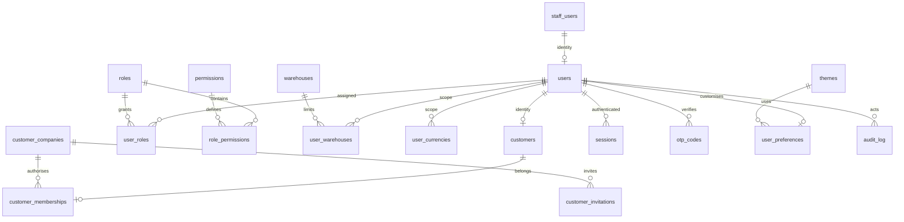
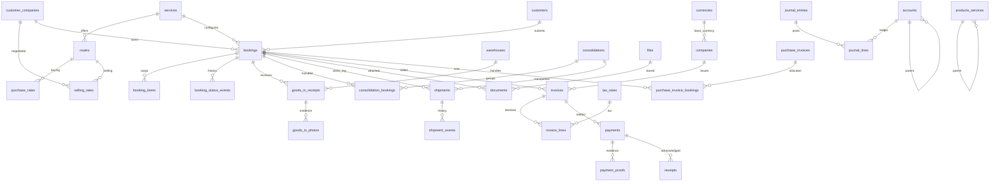
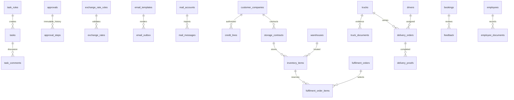

# UKR portal data model

## PostgreSQL foundation

Phase 1 adds numbered migrations to the existing staff and Booking Lab schemas. Existing staff password records remain in `staff_users`; `users.staff_user_id` maps the authenticated identity. Passwords are not copied into a second authentication system. Existing customer mappings are preserved through explicit legacy identifiers.

New tables have UUID identifiers, created_at, updated_at, created_by and deleted_at metadata. Foreign keys specify deletion behaviour. Foreign-key, date, status and code indexes are created by the migration. Monetary values use NUMERIC(18,4) with a currency reference. Applied migration checksums are immutable. Audit and workflow histories reject modification and deletion.

## Identity and access

An email has one company membership. Company access is explicit: invitations, OTP verification and approved membership are separate controls. Matching an unverified domain or entering a VAT number does not authorise access.

## Shared operational and finance relationships

## Shared controls and later service domains

## What is active in Phase 1

Identity/session/OTP controls, approved company memberships, roles and permission matrix, master data, preferences, task rules and Task Center, approvals, exchange-rate controls, email template/outbox core and storage/backup abstractions.

Operational tables are reserved for the later phases in the final brief. Their existence is not a claim that shipment execution, accounting, fulfilment or fleet workflows are enabled. No rates, customer shipments, invoices, balances or staff passwords are fabricated or seeded. Each later phase must add its operational constraints and update this model.
